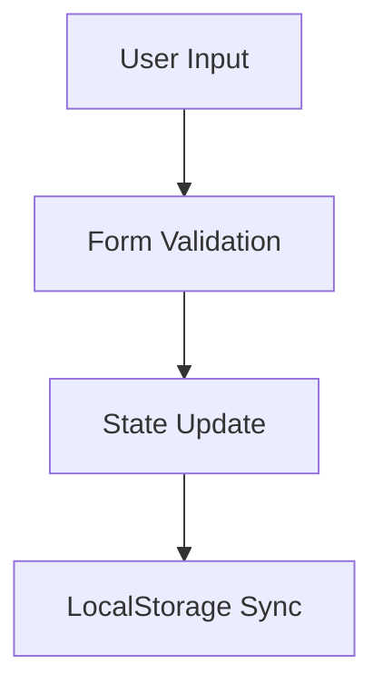

# Documentation Generator Command

Carefully and thoroughly generate both technical documentation for developers and user-friendly guides for end users for $ARGUMENTS:
- Developer Documentation - Technical specs, API details, implementation notes
- User Documentation - Simple guide with screenshots placeholders, step-by-step instructions

## Arguments

- **No arguments or "all"**: Document the entire application/project
  - Creates overview documentation (entire app architecture and user guide)
  - ALSO generates individual feature documentation for each major component
  - Results in: docs/dev/app-overview.md, docs/user/user-guide.md, plus feature-specific docs
  - Example: `/document-feature` or `/document-feature all`

- **Specific component/feature name**: Focus documentation on that specific area only
  - Example: `/document-feature Dashboard` - documents only Dashboard component
  - Example: `/document-feature ExpenseForm` - documents only the form component
  - Results in: docs/dev/dashboard.md and docs/user/dashboard.md

- **File path**: Document the feature in the specified file
  - Example: `/document-feature src/components/Dashboard.tsx`
  - Results in: docs/dev/dashboard.md and docs/user/dashboard.md

## Process

1. **Analyze Project Structure**
   - Read $ARGUMENTS to understand scope (entire app vs. specific feature)
   - If documenting entire app, identify all major features/components
   - Identify if feature is frontend/backend/full-stack
   - Auto-detect related files (tests, configs, types, utilities)
   - Search for existing documentation to link to

2. **Gather Information**
   - Read relevant source files
   - Check package.json for dependencies and version
   - Look for CHANGELOG.md entries
   - Identify component relationships and data flow

3. **Generate Documentation**

   **For Entire App (no arguments or "all"):**
   - Create overview documentation:
     - docs/dev/app-overview.md (or {project-name}-overview.md)
     - docs/user/user-guide.md (or {project-name}-guide.md)
   - Create individual feature documentation for each major component:
     - docs/dev/{feature-name}.md for each feature
     - docs/user/{feature-name}.md for user-facing features
   - Create an index/README in docs/ directory linking to all documentation

   **For Specific Feature:**
   - Create feature-specific documentation:
     - docs/dev/{filename}.md
     - docs/user/{filename}.md
   - Use consistent naming (kebab-case for filenames)

4. **Cross-Reference Documentation**
   - Overview docs should link to individual feature docs
   - Feature docs should link back to overview
   - Create breadcrumb navigation in headers
   - Generate docs/README.md as table of contents

5. **Post-Generation Quality Checks**
   - Verify all internal file links are valid
   - Check references to code locations (file:line)
   - Suggest running spell checker if available
   - Validate code examples are syntactically correct

## Output Requirements

### Documentation Structure

**For Entire App:**
```
docs/
├── README.md                 # Table of contents with links to all docs
├── dev/
│   ├── app-overview.md      # High-level architecture, tech stack, setup
│   ├── feature-1.md         # Detailed component documentation
│   ├── feature-2.md
│   └── ...
└── user/
    ├── user-guide.md        # Getting started, overview of all features
    ├── feature-1.md         # How to use specific feature
    ├── feature-2.md
    └── ...
```

**For Specific Feature:**
```
docs/
├── dev/
│   └── feature-name.md
└── user/
    └── feature-name.md
```

### Overview Documentation (Entire App) Should Include:
- High-level architecture and design decisions
- Technology stack and dependencies
- Project structure and organization
- Setup and installation instructions
- Development workflow
- Links to all individual feature documentation
- Overall data flow and state management strategy

### Individual Feature Documentation Should Include:
- Specific component/feature implementation details
- Component props, hooks, and APIs
- Feature-specific user instructions
- Code examples for that feature
- Links back to overview documentation

### Developer Documentation Should Include:
- Architecture overview and technology stack
- Component/module relationships with Mermaid diagrams where helpful
- Data models and TypeScript interfaces
- API reference (functions, hooks, utilities)
- Code examples with file locations
- Performance considerations
- Security notes
- Testing information (if tests exist)
- Future enhancement ideas
- Troubleshooting section

### User Documentation Should Include:
- Getting started guide
- Step-by-step instructions with clear headings
- Screenshot placeholders marked as `![Description - Placeholder]`
  - Note: If UI-based feature, suggest running dev server to capture actual screenshots
- Visual aids (tables, lists, numbered steps)
- Tips and best practices
- Common use cases and examples
- Troubleshooting section
- FAQ section
- Accessibility information (keyboard shortcuts, screen reader support)

### Both Documentation Types Should:
- Use proper markdown formatting
- Include table of contents for long documents
- Auto-link to related existing documentation
- Include version information from package.json
- Link to external dependency documentation where relevant
- Use consistent terminology throughout

## Special Cases

### Backend/API Features
- Document API endpoints with request/response examples
- Include authentication/authorization requirements
- Provide cURL examples or request samples
- Document error responses and status codes

### Frontend/UI Features
- Include component props and interfaces
- Document state management
- Explain user interactions and workflows
- Note browser compatibility requirements

### Full-Stack Features
- Separate frontend and backend sections
- Document data flow between layers
- Include integration examples

## Screenshots (For UI Features)

**IMPORTANT**: After generating documentation, automatically capture screenshots using Playwright.

### Automated Screenshot Capture Process

1. **Check Dependencies**:
   - Verify `playwright` is in `devDependencies`
   - If missing, install: `npm install -D playwright @playwright/test`
   - Also install `glob` if needed: `npm install -D glob`

2. **Verify Screenshot Scripts Exist**:
   Required scripts in `scripts/` directory:
   - `capture-screenshots.mjs` - Uses Playwright to capture screenshots
   - `update-screenshot-links.mjs` - Updates markdown image references
   - `generate-docs-with-screenshots.mjs` - Orchestrates full workflow

3. **Run Automated Screenshot Capture**:
   After generating documentation, execute:
   ```bash
   npm run docs:screenshots
   ```

   This automated workflow:
   - ✅ Checks if dev server is running at localhost:3000
   - ✅ Starts dev server automatically if needed
   - ✅ Waits for app to be ready
   - ✅ Captures all screenshots using Playwright (headless browser)
   - ✅ Saves screenshots to `docs/images/`
   - ✅ Updates documentation markdown files with image paths
   - ✅ Stops dev server if it was started by the script

4. **Screenshot Documentation Format**:
   - Initially insert: ``
   - Or use placeholders: `![Description - Placeholder]`
   - The `update-screenshot-links.mjs` script auto-updates placeholders

5. **Common Screenshot Mappings**:
   ```
   Dashboard Overview → dashboard-with-data.png
   Navigation Bar → navigation-bar.png
   Expense Form → expense-form-add.png
   Expense Form Filled → expense-form-filled.png
   Expense List → expense-list-page.png
   Expense Table → expense-table.png
   Monthly Trend Chart → monthly-trend-chart.png
   Category Pie Chart → category-pie-chart.png
   Top Categories → top-categories-list.png
   Summary Cards → summary-cards.png
   ```

### Manual Screenshot Capture (Fallback Only)

Use only if automated capture fails:
1. Run `npm run dev` manually
2. Navigate to each feature
3. Capture screenshots manually
4. Save to `docs/images/` directory with descriptive names
5. Update markdown image references

### Screenshot Script Package.json Entries

Ensure these scripts are in package.json:
```json
"scripts": {
  "capture-screenshots": "node scripts/capture-screenshots.mjs",
  "update-screenshot-links": "node scripts/update-screenshot-links.mjs",
  "docs:screenshots": "node scripts/generate-docs-with-screenshots.mjs"
}
```

## Diagrams

Include Mermaid diagrams where helpful:
- Architecture diagrams
- Component relationship diagrams
- Data flow diagrams
- State machine diagrams (for complex workflows)

Example:


## Documentation Index

When documenting entire app, create docs/README.md as a central hub:

```markdown
# Project Documentation

## For Developers
- [App Overview](dev/app-overview.md) - Architecture and setup
- [Feature 1](dev/feature-1.md) - Feature 1 technical details
- [Feature 2](dev/feature-2.md) - Feature 2 technical details

## For Users
- [User Guide](user/user-guide.md) - Getting started
- [Feature 1 Guide](user/feature-1.md) - How to use Feature 1
- [Feature 2 Guide](user/feature-2.md) - How to use Feature 2

## Quick Links
- [API Reference](dev/api-reference.md) (if applicable)
- [Troubleshooting](user/troubleshooting.md)
- [FAQ](user/faq.md)
```

## Identifying Major Features

When documenting entire app, identify major features by:
- Main components in src/components/ or src/features/
- Distinct pages/routes in app/ or pages/ directories
- Standalone modules with significant functionality
- Features mentioned in package.json scripts or README

Typical threshold: Components with 100+ lines or distinct user-facing functionality

## Final Step

1. **Generate Documentation Files**:
   - Create all markdown files
   - Include screenshot references (actual paths or placeholders)
   - Cross-reference all documentation

2. **Capture Screenshots** (CRITICAL):
   - Run `npm run docs:screenshots`
   - This captures ALL screenshots automatically
   - Updates all documentation with real screenshot paths
   - Provides visual confirmation of completion

3. **Verification**:
   - List all documentation files created with their file paths
   - Confirm screenshots were captured: `docs/images/*.png`
   - Verify screenshot links in user documentation work

4. **Report**:
   - Suggest improvements for this document-feature command file
   - Report any missing information that would improve documentation quality
   - Note if screenshot capture succeeded or failed (with reasons)