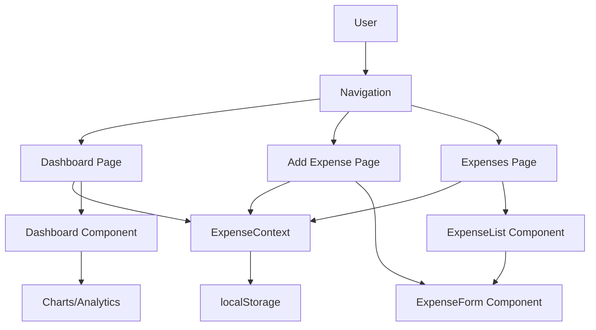
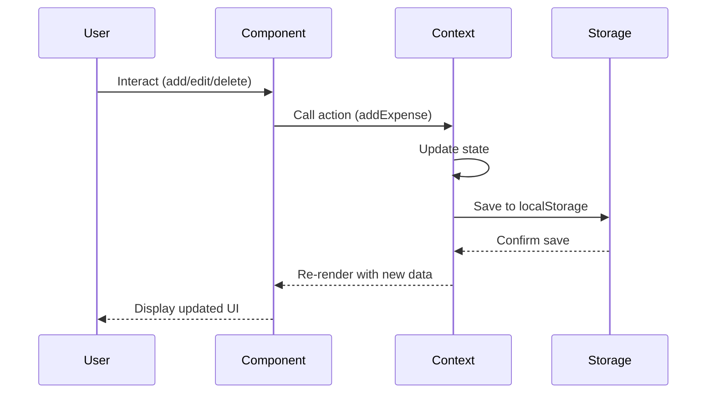

# Expense Tracker - Application Overview

**Version**: 0.1.0
**Last Updated**: 2025-11-09

## Table of Contents

1. [Introduction](#introduction)
2. [Architecture](#architecture)
3. [Technology Stack](#technology-stack)
4. [Project Structure](#project-structure)
5. [Setup and Installation](#setup-and-installation)
6. [Development Workflow](#development-workflow)
7. [Core Features](#core-features)
8. [Data Flow](#data-flow)
9. [State Management](#state-management)
10. [Related Documentation](#related-documentation)

---

## Introduction

Expense Tracker is a full-stack web application built with Next.js that enables users to track personal expenses with real-time analytics, filtering capabilities, and data export features. The application uses browser localStorage for data persistence, making it a client-side only solution with no backend requirements.

### Key Capabilities

- ✅ Add, edit, and delete expenses
- ✅ Categorize expenses (Food, Transportation, Entertainment, Shopping, Bills, Other)
- ✅ Real-time analytics dashboard with charts
- ✅ Advanced filtering (category, date range, search)
- ✅ CSV data export
- ✅ Responsive design (mobile and desktop)
- ✅ Sample data generation for testing

---

## Architecture

### Design Decisions

The application follows a **component-based architecture** with:

1. **Client-Side Only**: No backend server required
2. **React Context Pattern**: Global state management without Redux
3. **App Router**: Next.js 14 App Router for routing
4. **Type-Safe**: Full TypeScript implementation
5. **Form Validation**: Zod schema validation with React Hook Form
6. **Responsive UI**: Tailwind CSS with mobile-first approach

### Application Flow



---

## Technology Stack

### Core Dependencies

| Technology | Version | Purpose |
|------------|---------|---------|
| Next.js | 14.2.31 | React framework with App Router |
| React | 18 | UI library |
| TypeScript | 5 | Type safety |
| Tailwind CSS | 3.4.1 | Utility-first styling |
| React Hook Form | 7.62.0 | Form state management |
| Zod | 4.0.17 | Schema validation |
| Recharts | 3.1.2 | Data visualization |
| date-fns | 4.1.0 | Date manipulation |
| Lucide React | 0.539.0 | Icon library |

### Utility Libraries

- **clsx** + **tailwind-merge**: Dynamic className handling
- **@hookform/resolvers**: Zod integration with React Hook Form

---

## Project Structure

```
expense-tracker-ai/
├── src/
│   ├── app/                      # Next.js App Router pages
│   │   ├── layout.tsx           # Root layout with providers
│   │   ├── page.tsx             # Dashboard home page
│   │   ├── add/
│   │   │   └── page.tsx         # Add expense page
│   │   └── expenses/
│   │       └── page.tsx         # Expense list page
│   │
│   ├── components/              # React components
│   │   ├── Dashboard.tsx        # Analytics dashboard
│   │   ├── ExpenseForm.tsx      # Add/edit expense form
│   │   ├── ExpenseList.tsx      # Expense table with filters
│   │   ├── Navigation.tsx       # Top navigation bar
│   │   └── SampleDataButton.tsx # Sample data loader
│   │
│   ├── context/
│   │   └── ExpenseContext.tsx   # Global state management
│   │
│   ├── lib/
│   │   ├── storage.ts           # localStorage utilities
│   │   └── utils.ts             # Helper functions
│   │
│   └── types/
│       └── expense.ts           # TypeScript type definitions
│
├── docs/                        # Documentation
│   ├── README.md               # Documentation index
│   ├── dev/                    # Developer documentation
│   └── user/                   # User documentation
│
├── public/                     # Static assets
├── .claude/                    # Claude Code commands
└── [config files]              # Various config files
```

### File Naming Conventions

- **Components**: PascalCase (e.g., `ExpenseForm.tsx`)
- **Utilities**: camelCase (e.g., `utils.ts`)
- **Types**: camelCase (e.g., `expense.ts`)
- **Pages**: lowercase with Next.js conventions

---

## Setup and Installation

### Prerequisites

- Node.js 20+ installed
- npm, yarn, pnpm, or bun package manager

### Installation Steps

```bash
# Clone the repository
git clone <repository-url>
cd expense-tracker-ai

# Install dependencies
npm install

# Run development server
npm run dev

# Open browser to http://localhost:3000
```

### Build for Production

```bash
# Create production build
npm run build

# Start production server
npm start
```

### Linting

```bash
# Run ESLint
npm run lint
```

---

## Development Workflow

### Adding a New Feature

1. **Create Types** (if needed) in `src/types/`
2. **Build Component** in `src/components/`
3. **Add to Context** (if state needed) in `src/context/ExpenseContext.tsx`
4. **Create Page** (if needed) in `src/app/`
5. **Update Navigation** in `src/components/Navigation.tsx`
6. **Test** manually in browser
7. **Document** in `docs/`

### Development Best Practices

- Use TypeScript strictly (avoid `any`)
- Follow existing component patterns
- Keep components focused and single-purpose
- Use the `cn()` utility for conditional classes
- Validate all forms with Zod schemas
- Update types when changing data structures

---

## Core Features

### Major Components

The application consists of these primary features:

1. **[Dashboard](dashboard.md)** - Analytics and charts ([src/components/Dashboard.tsx](../../src/components/Dashboard.tsx))
2. **[Expense Form](expense-form.md)** - Add/edit expenses ([src/components/ExpenseForm.tsx](../../src/components/ExpenseForm.tsx))
3. **[Expense List](expense-list.md)** - View/filter expenses ([src/components/ExpenseList.tsx](../../src/components/ExpenseList.tsx))
4. **[Expense Context](expense-context.md)** - State management ([src/context/ExpenseContext.tsx](../../src/context/ExpenseContext.tsx))
5. **Navigation** - App navigation ([src/components/Navigation.tsx](../../src/components/Navigation.tsx))

### Supporting Features

- **Storage Utilities** - localStorage operations ([src/lib/storage.ts](../../src/lib/storage.ts))
- **Helper Functions** - Formatting and utilities ([src/lib/utils.ts](../../src/lib/utils.ts))
- **Type Definitions** - TypeScript interfaces ([src/types/expense.ts](../../src/types/expense.ts))

---

## Data Flow

### High-Level Data Architecture



### Data Persistence Strategy

1. **Initial Load**: Context loads data from localStorage on mount
2. **User Action**: Component calls context method
3. **State Update**: Context updates React state
4. **Storage Sync**: Context immediately syncs to localStorage
5. **Re-render**: Components receive updated data via context

### Data Model

See [src/types/expense.ts](../../src/types/expense.ts) for complete type definitions.

**Core Entity: Expense**
```typescript
interface Expense {
  id: string;              // Unique identifier
  amount: number;          // Expense amount
  category: ExpenseCategory; // One of 6 categories
  description: string;     // User description
  date: string;            // ISO date string (YYYY-MM-DD)
  createdAt: string;       // ISO timestamp
}
```

---

## State Management

### React Context Pattern

The application uses **ExpenseContext** for global state management:

**Location**: [src/context/ExpenseContext.tsx](../../src/context/ExpenseContext.tsx)

#### Context Provider Structure

```typescript
<ExpenseProvider>
  {/* All app components */}
</ExpenseProvider>
```

#### Available Context Values

```typescript
const {
  expenses,           // All expenses
  filteredExpenses,   // Filtered by current filters
  filters,            // Current filter state
  addExpense,         // Add new expense
  updateExpense,      // Update existing expense
  deleteExpense,      // Delete expense
  setFilters,         // Update filters
  exportExpenses,     // Export to CSV
  isLoading          // Loading state
} = useExpenses();
```

### Why Context Over Redux?

- Simpler setup for small-to-medium apps
- No additional dependencies
- Built-in to React
- Sufficient for our use case (single data entity)

---

## Related Documentation

### Developer Documentation

- **[Dashboard Component](dashboard.md)** - Analytics and charts implementation
- **[Expense Form Component](expense-form.md)** - Form validation and submission
- **[Expense List Component](expense-list.md)** - Filtering and table rendering
- **[Expense Context](expense-context.md)** - State management details

### User Documentation

- **[User Guide](../user/user-guide.md)** - Getting started
- **[Dashboard Guide](../user/dashboard.md)** - Using the analytics dashboard
- **[Adding Expenses](../user/expense-form.md)** - How to add and edit expenses
- **[Managing Expenses](../user/expense-list.md)** - Viewing and filtering expenses

### External Resources

- [Next.js Documentation](https://nextjs.org/docs)
- [React Documentation](https://react.dev)
- [TypeScript Handbook](https://www.typescriptlang.org/docs/)
- [Tailwind CSS Docs](https://tailwindcss.com/docs)
- [Recharts Documentation](https://recharts.org/)
- [React Hook Form](https://react-hook-form.com/)
- [Zod Documentation](https://zod.dev/)

---

## Performance Considerations

### Optimizations

1. **useMemo** - Dashboard analytics calculations are memoized
2. **Client Components** - Only use 'use client' where needed
3. **Code Splitting** - Next.js automatic code splitting
4. **LocalStorage** - Fast client-side storage

### Known Limitations

- No virtualization in expense list (may slow with 1000+ expenses)
- localStorage has 5-10MB limit
- Synchronous localStorage operations may block on large datasets

### Future Optimization Opportunities

- Implement virtual scrolling for large lists
- Move to IndexedDB for better performance
- Add service worker for offline support
- Implement pagination for expense list

---

## Security

### Current Security Measures

- React XSS protection (automatic escaping)
- Zod validation prevents invalid data
- CSV export properly quotes strings
- No external API calls or data transmission

### Security Limitations

- No authentication (client-side only app)
- Data accessible to anyone with device access
- No encryption of stored data

---

## Browser Compatibility

- Modern browsers with ES2020+ support
- Requires localStorage API
- Tested on: Chrome, Firefox, Safari, Edge
- Mobile browsers supported

---

## Troubleshooting

### Common Development Issues

**Port 3000 already in use**
```bash
# Kill process on port 3000
npx kill-port 3000
# Or use different port
npm run dev -- -p 3001
```

**TypeScript errors**
```bash
# Clear Next.js cache
rm -rf .next
npm run dev
```

**Styling not updating**
```bash
# Clear Tailwind cache
rm -rf .next
npm run dev
```

---

## Contributing

### Code Style

- Follow existing patterns
- Use TypeScript strictly
- Write meaningful component names
- Keep functions small and focused
- Comment complex logic

### Testing Locally

1. Run `npm run dev`
2. Open http://localhost:3000
3. Click "Load Sample Data"
4. Test all CRUD operations
5. Test filtering and export
6. Test on mobile viewport

---

## Changelog

See [CHANGELOG.md](../../CHANGELOG.md) for version history (if exists).

---

## License

[Add license information]

---

**Last Updated**: 2025-11-09
**Maintained by**: [Your Team]
