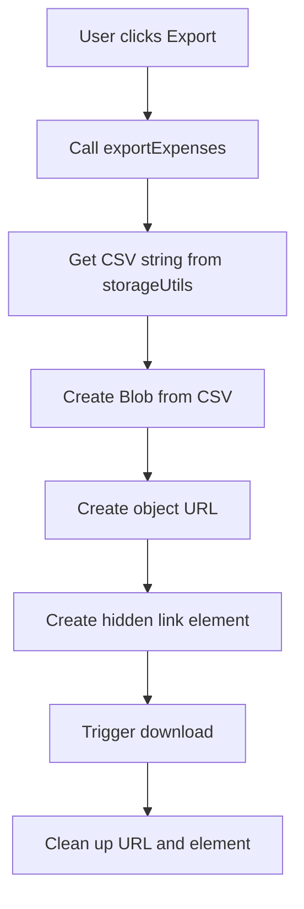
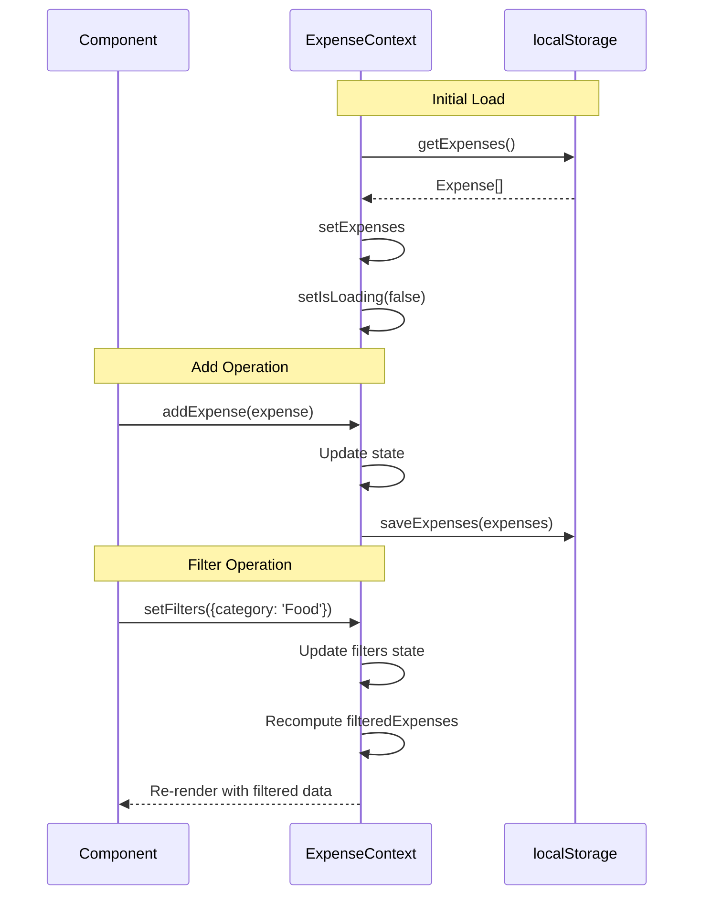

# ExpenseContext - Developer Documentation

**Context**: `ExpenseContext`
**Location**: [src/context/ExpenseContext.tsx](../../src/context/ExpenseContext.tsx)
**Type**: React Context with Provider

[← Back to App Overview](app-overview.md)

---

## Overview

ExpenseContext provides global state management for the entire application. It handles expense CRUD operations, filtering logic, CSV export, and localStorage synchronization.

## Context API

### Provider Component

```typescript
export function ExpenseProvider({ children }: { children: React.ReactNode }): JSX.Element
```

**Usage**:
```typescript
<ExpenseProvider>
  <App />
</ExpenseProvider>
```

### Hook

```typescript
export function useExpenses(): ExpenseContextType
```

**Usage**:
```typescript
const {
  expenses,
  filteredExpenses,
  filters,
  addExpense,
  updateExpense,
  deleteExpense,
  setFilters,
  exportExpenses,
  isLoading
} = useExpenses();
```

---

## Context Type Definition

**Location**: Lines [7-17](../../src/context/ExpenseContext.tsx#L7-L17)

```typescript
interface ExpenseContextType {
  expenses: Expense[];              // All expenses
  filteredExpenses: Expense[];      // Filtered by current filters
  filters: ExpenseFilters;          // Current filter state
  addExpense: (expense: Expense) => void;
  updateExpense: (expense: Expense) => void;
  deleteExpense: (id: string) => void;
  setFilters: (filters: ExpenseFilters) => void;
  exportExpenses: () => void;
  isLoading: boolean;               // Initial load state
}
```

---

## State Management

### State Variables

**Location**: Lines [22-24](../../src/context/ExpenseContext.tsx#L22-L24)

```typescript
const [expenses, setExpenses] = useState<Expense[]>([]);
const [filters, setFilters] = useState<ExpenseFilters>({});
const [isLoading, setIsLoading] = useState(true);
```

### Initial Load

**Location**: Lines [26-30](../../src/context/ExpenseContext.tsx#L26-L30)

```typescript
useEffect(() => {
  const loadedExpenses = storageUtils.getExpenses();
  setExpenses(loadedExpenses);
  setIsLoading(false);
}, []);
```

**Flow**:
1. Component mounts
2. `isLoading` starts as `true`
3. Load expenses from localStorage
4. Set expenses state
5. Set `isLoading` to `false`

---

## CRUD Operations

### Add Expense

**Location**: Lines [32-36](../../src/context/ExpenseContext.tsx#L32-L36)

```typescript
const addExpense = (expense: Expense) => {
  const updatedExpenses = [...expenses, expense];
  setExpenses(updatedExpenses);
  storageUtils.saveExpenses(updatedExpenses);
};
```

**Steps**:
1. Create new array with existing expenses + new expense
2. Update React state
3. Sync to localStorage

### Update Expense

**Location**: Lines [38-44](../../src/context/ExpenseContext.tsx#L38-L44)

```typescript
const updateExpense = (updatedExpense: Expense) => {
  const updatedExpenses = expenses.map(exp =>
    exp.id === updatedExpense.id ? updatedExpense : exp
  );
  setExpenses(updatedExpenses);
  storageUtils.saveExpenses(updatedExpenses);
};
```

**Steps**:
1. Map over expenses array
2. Replace expense with matching ID
3. Update React state
4. Sync to localStorage

### Delete Expense

**Location**: Lines [46-50](../../src/context/ExpenseContext.tsx#L46-L50)

```typescript
const deleteExpense = (id: string) => {
  const updatedExpenses = expenses.filter(exp => exp.id !== id);
  setExpenses(updatedExpenses);
  storageUtils.saveExpenses(updatedExpenses);
};
```

**Steps**:
1. Filter out expense with given ID
2. Update React state
3. Sync to localStorage

---

## Filtering Logic

### Filter Implementation

**Location**: Lines [65-81](../../src/context/ExpenseContext.tsx#L65-L81)

```typescript
const filteredExpenses = expenses.filter(expense => {
  if (filters.category && filters.category !== 'All' && expense.category !== filters.category) {
    return false;
  }
  if (filters.startDate && expense.date < filters.startDate) {
    return false;
  }
  if (filters.endDate && expense.date > filters.endDate) {
    return false;
  }
  if (filters.searchTerm &&
      !expense.description.toLowerCase().includes(filters.searchTerm.toLowerCase()) &&
      !expense.category.toLowerCase().includes(filters.searchTerm.toLowerCase())) {
    return false;
  }
  return true;
});
```

### Filter Conditions

| Filter | Logic | Example |
|--------|-------|---------|
| category | Exact match (or "All") | `filters.category === 'Food'` |
| startDate | Expense date >= start | `expense.date >= '2025-01-01'` |
| endDate | Expense date <= end | `expense.date <= '2025-01-31'` |
| searchTerm | Contains in description OR category | `includes('coffee')` |

**Note**: All filters use AND logic (all must match)

### Why Computed, Not Stored?

```typescript
// Not a state variable - computed on every render
const filteredExpenses = expenses.filter(...)
```

**Benefits**:
- Always in sync with expenses and filters
- No need to manually update
- Simple and predictable

**Performance**:
- Acceptable for small-medium datasets
- Consider memoization for large datasets

---

## CSV Export

**Location**: Lines [52-63](../../src/context/ExpenseContext.tsx#L52-L63)

```typescript
const exportExpenses = () => {
  const csvContent = storageUtils.exportToCSV(filteredExpenses);
  const blob = new Blob([csvContent], { type: 'text/csv' });
  const url = window.URL.createObjectURL(blob);
  const link = document.createElement('a');
  link.href = url;
  link.download = `expenses-${new Date().toISOString().split('T')[0]}.csv`;
  document.body.appendChild(link);
  link.click();
  document.body.removeChild(link);
  window.URL.revokeObjectURL(url);
};
```

### Export Flow



**Key Points**:
- Exports `filteredExpenses` (respects current filters)
- Filename includes current date
- Creates temporary download link
- Cleans up resources after download

---

## localStorage Integration

### Storage Utilities

**Imported from**: [src/lib/storage.ts](../../src/lib/storage.ts)

```typescript
import { storageUtils } from '@/lib/storage';
```

### Methods Used

**getExpenses()**:
```typescript
storageUtils.getExpenses(): Expense[]
```
- Called once on mount
- Returns array from localStorage
- Returns `[]` if empty

**saveExpenses()**:
```typescript
storageUtils.saveExpenses(expenses: Expense[]): void
```
- Called after every mutation
- Syncs state to localStorage
- Overwrites existing data

---

## Provider Implementation

**Location**: Lines [83-99](../../src/context/ExpenseContext.tsx#L83-L99)

```typescript
return (
  <ExpenseContext.Provider
    value={{
      expenses,
      filteredExpenses,
      filters,
      addExpense,
      updateExpense,
      deleteExpense,
      setFilters,
      exportExpenses,
      isLoading,
    }}
  >
    {children}
  </ExpenseContext.Provider>
);
```

**Provided Values**:
- State: `expenses`, `filteredExpenses`, `filters`, `isLoading`
- Functions: `addExpense`, `updateExpense`, `deleteExpense`, `setFilters`, `exportExpenses`

---

## Hook Usage

### Error Handling

**Location**: Lines [102-108](../../src/context/ExpenseContext.tsx#L102-L108)

```typescript
export function useExpenses() {
  const context = useContext(ExpenseContext);
  if (context === undefined) {
    throw new Error('useExpenses must be used within an ExpenseProvider');
  }
  return context;
}
```

**Purpose**: Ensures hook is only used within provider

**Error Message**: Clear guidance if used incorrectly

---

## Data Flow Diagram



---

## Performance Considerations

### Optimizations

1. **Single Source of Truth**: Expenses stored once
2. **Computed Filtering**: No duplicate filtered state
3. **Batch Operations**: Single state update + storage sync

### Potential Issues

1. **Large Datasets**: Filtering may slow down
2. **Frequent Updates**: Each mutation syncs to localStorage
3. **No Debouncing**: Filters apply immediately

### Improvements

**Memoize Filtered Expenses**:
```typescript
const filteredExpenses = useMemo(() => {
  return expenses.filter(/* filter logic */);
}, [expenses, filters]);
```

**Debounce Search**:
```typescript
const debouncedSearchTerm = useDebounce(filters.searchTerm, 300);
// Use debouncedSearchTerm for filtering
```

**IndexedDB** (for large datasets):
- Better performance than localStorage
- Larger storage capacity
- Async operations

---

## Testing

### Test Cases

**Provider**:
1. ✅ Loads expenses from localStorage on mount
2. ✅ Provides all context values
3. ✅ Throws error if hook used outside provider

**CRUD**:
1. ✅ addExpense adds to state and storage
2. ✅ updateExpense modifies correct expense
3. ✅ deleteExpense removes from state and storage

**Filtering**:
1. ✅ Category filter works
2. ✅ Date range filter works
3. ✅ Search filter works
4. ✅ Multiple filters combine (AND)
5. ✅ Clearing filters shows all

**Export**:
1. ✅ Export creates CSV file
2. ✅ Export respects filters
3. ✅ Filename includes date

---

## Integration Points

### Where It's Used

**Root Layout**: [src/app/layout.tsx](../../src/app/layout.tsx)
```typescript
<ExpenseProvider>
  <Navigation />
  {children}
</ExpenseProvider>
```

**Components Using Context**:
- Dashboard
- ExpenseForm
- ExpenseList
- SampleDataButton

---

## Future Enhancements

1. **Undo/Redo**
   - Store operation history
   - Revert recent changes

2. **Optimistic Updates**
   - Update UI immediately
   - Sync to storage in background

3. **Conflict Resolution**
   - Handle multi-tab scenarios
   - Sync between tabs

4. **Caching**
   - Cache computed values
   - Invalidate on expense changes

5. **Middleware**
   - Add logging
   - Add analytics tracking
   - Add error reporting

---

## Related Documentation

- **[App Overview](app-overview.md)** - Application architecture
- **[Storage Utilities](../../src/lib/storage.ts)** - localStorage implementation
- **[Type Definitions](../../src/types/expense.ts)** - Expense types

---

## API Reference

### ExpenseProvider

```typescript
function ExpenseProvider({ children }: { children: React.ReactNode }): JSX.Element
```

### useExpenses Hook

```typescript
function useExpenses(): ExpenseContextType
```

**Returns**:
```typescript
{
  expenses: Expense[];
  filteredExpenses: Expense[];
  filters: ExpenseFilters;
  addExpense: (expense: Expense) => void;
  updateExpense: (expense: Expense) => void;
  deleteExpense: (id: string) => void;
  setFilters: (filters: ExpenseFilters) => void;
  exportExpenses: () => void;
  isLoading: boolean;
}
```

---

**Last Updated**: 2025-11-09
