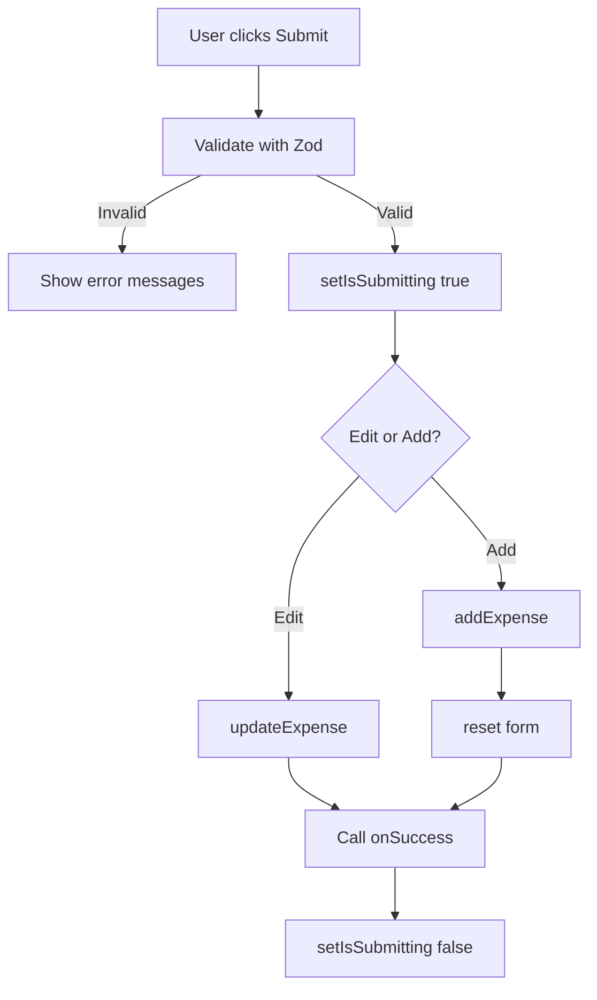

# ExpenseForm Component - Developer Documentation

**Component**: `ExpenseForm`
**Location**: [src/components/ExpenseForm.tsx](../../src/components/ExpenseForm.tsx)
**Type**: Client Component (`'use client'`)

[← Back to App Overview](app-overview.md)

---

## Overview

The ExpenseForm component handles both creating new expenses and editing existing ones. It uses React Hook Form for form state management and Zod for schema validation, providing a type-safe and performant form experience.

## Component Signature

```typescript
interface ExpenseFormProps {
  expense?: Expense;      // Optional: for edit mode
  onSuccess?: () => void; // Optional: callback after save
}

export function ExpenseForm({ expense, onSuccess }: ExpenseFormProps): JSX.Element
```

## Dependencies

```typescript
import { useState } from 'react';
import { useForm } from 'react-hook-form';
import { zodResolver } from '@hookform/resolvers/zod';
import { z } from 'zod';
import { format } from 'date-fns';
import { Calendar, DollarSign, Tag, FileText } from 'lucide-react';
import { ExpenseCategory, Expense, ExpenseFormData } from '@/types/expense';
import { useExpenses } from '@/context/ExpenseContext';
import { generateId } from '@/lib/utils';
```

---

## Usage Modes

### Add Mode (Default)

```typescript
<ExpenseForm />
```

**Behavior**:
- Empty form
- Date defaults to today
- Submit creates new expense
- Form resets after successful submission

### Edit Mode

```typescript
<ExpenseForm
  expense={existingExpense}
  onSuccess={() => setEditingExpense(null)}
/>
```

**Behavior**:
- Form pre-filled with expense data
- Submit updates existing expense
- Form does NOT reset after update
- `onSuccess` callback triggered after save

---

## Validation Schema

**Location**: Lines [13-21](../../src/components/ExpenseForm.tsx#L13-L21)

```typescript
const expenseSchema = z.object({
  amount: z.string()
    .min(1, 'Amount is required')
    .refine(
      (val) => !isNaN(Number(val)) && Number(val) > 0,
      'Amount must be a positive number'
    ),
  category: z.enum(['Food', 'Transportation', 'Entertainment', 'Shopping', 'Bills', 'Other']),
  description: z.string()
    .min(1, 'Description is required')
    .max(200, 'Description must be less than 200 characters'),
  date: z.string()
    .min(1, 'Date is required'),
});
```

### Validation Rules

| Field | Rules | Error Messages |
|-------|-------|----------------|
| amount | - Required<br>- Must be valid number<br>- Must be > 0 | "Amount is required"<br>"Amount must be a positive number" |
| category | - Required<br>- Must be valid enum value | Handled by schema |
| description | - Required<br>- Min 1 character<br>- Max 200 characters | "Description is required"<br>"Description must be less than 200 characters" |
| date | - Required<br>- Non-empty string | "Date is required" |

### Why Zod?

- **Type Safety**: Automatic TypeScript type inference
- **Runtime Validation**: Catches invalid data at runtime
- **Composable**: Easy to extend or modify rules
- **Error Messages**: Custom, user-friendly messages

---

## Form State Management

### React Hook Form Setup

**Location**: Lines [34-49](../../src/components/ExpenseForm.tsx#L34-L49)

```typescript
const {
  register,
  handleSubmit,
  reset,
  formState: { errors },
} = useForm<ExpenseFormData>({
  resolver: zodResolver(expenseSchema),
  defaultValues: expense ? {
    amount: expense.amount.toString(),
    category: expense.category,
    description: expense.description,
    date: expense.date,
  } : {
    date: format(new Date(), 'yyyy-MM-dd'),
  },
});
```

### Default Values Logic

**Add Mode** (no `expense` prop):
```typescript
{
  date: format(new Date(), 'yyyy-MM-dd')  // Today's date
  // Other fields: undefined
}
```

**Edit Mode** (with `expense` prop):
```typescript
{
  amount: expense.amount.toString(),  // Convert number to string
  category: expense.category,
  description: expense.description,
  date: expense.date
}
```

**Why convert amount to string?**: Input fields require string values, even for number inputs.

---

## Form Submission

### Submit Handler

**Location**: Lines [51-76](../../src/components/ExpenseForm.tsx#L51-L76)

```typescript
const onSubmit = async (data: ExpenseFormData) => {
  setIsSubmitting(true);
  try {
    const expenseData: Expense = {
      id: expense?.id || generateId(),
      amount: Number(data.amount),
      category: data.category,
      description: data.description,
      date: data.date,
      createdAt: expense?.createdAt || new Date().toISOString(),
    };

    if (expense) {
      updateExpense(expenseData);
    } else {
      addExpense(expenseData);
      reset();
    }

    onSuccess?.();
  } catch (error) {
    console.error('Error saving expense:', error);
  } finally {
    setIsSubmitting(false);
  }
};
```

### Submission Flow



### Key Behaviors

1. **Loading State**: `isSubmitting` prevents double-submission
2. **ID Handling**: Reuse existing ID or generate new one
3. **Timestamp**: Preserve `createdAt` for edits, new timestamp for adds
4. **Type Conversion**: Convert string amount to number
5. **Form Reset**: Only in add mode
6. **Callback**: Call `onSuccess` if provided

---

## Form Fields

### Amount Field

**Location**: Lines [87-102](../../src/components/ExpenseForm.tsx#L87-L102)

```typescript
<input
  {...register('amount')}
  type="number"
  step="0.01"
  placeholder="0.00"
  className="w-full px-3 py-2 border border-gray-300 rounded-md..."
/>
```

**Features**:
- Type: `number` input
- Step: `0.01` (allows decimals)
- Placeholder: `0.00`
- Error display below field

### Category Field

**Location**: Lines [104-122](../../src/components/ExpenseForm.tsx#L104-L122)

```typescript
<select
  {...register('category')}
  className="w-full px-3 py-2 border border-gray-300 rounded-md..."
>
  {categories.map((category) => (
    <option key={category} value={category}>
      {category}
    </option>
  ))}
</select>
```

**Features**:
- Type: `<select>` dropdown
- Options: All 6 categories
- Default: First category (Food) in add mode, existing in edit mode

**Categories Array** (Line 23):
```typescript
const categories: ExpenseCategory[] = [
  'Food', 'Transportation', 'Entertainment', 'Shopping', 'Bills', 'Other'
];
```

### Description Field

**Location**: Lines [124-138](../../src/components/ExpenseForm.tsx#L124-L138)

```typescript
<input
  {...register('description')}
  type="text"
  placeholder="What did you spend on?"
  className="w-full px-3 py-2 border border-gray-300 rounded-md..."
/>
```

**Features**:
- Type: `text` input
- Max length: 200 chars (validated by Zod)
- Helpful placeholder

### Date Field

**Location**: Lines [140-153](../../src/components/ExpenseForm.tsx#L140-L153)

```typescript
<input
  {...register('date')}
  type="date"
  className="w-full px-3 py-2 border border-gray-300 rounded-md..."
/>
```

**Features**:
- Type: `date` input (native date picker)
- Default: Today's date in add mode
- Format: `yyyy-MM-dd` (ISO date string)

---

## Form Actions

### Reset Button

**Location**: Lines [156-162](../../src/components/ExpenseForm.tsx#L156-L162)

```typescript
<button
  type="button"
  onClick={() => reset()}
  className="px-4 py-2 text-sm font-medium text-gray-700 bg-white..."
>
  Reset
</button>
```

**Behavior**:
- Resets form to default values
- Clears validation errors
- Does NOT submit form

### Submit Button

**Location**: Lines [163-169](../../src/components/ExpenseForm.tsx#L163-L169)

```typescript
<button
  type="submit"
  disabled={isSubmitting}
  className="px-4 py-2 text-sm font-medium text-white bg-blue-600..."
>
  {isSubmitting ? 'Saving...' : expense ? 'Update Expense' : 'Add Expense'}
</button>
```

**Dynamic Text**:
- `"Saving..."` - While submitting
- `"Update Expense"` - Edit mode
- `"Add Expense"` - Add mode

**Disabled State**: Prevents submission while `isSubmitting` is true

---

## Error Handling

### Field-Level Errors

**Pattern** (example for amount):
```typescript
{errors.amount && (
  <p className="mt-1 text-sm text-red-600">{errors.amount.message}</p>
)}
```

**Behavior**:
- Errors appear below each field
- Red text (`text-red-600`)
- Shows custom message from Zod schema
- Only visible when field has error

### Error Display Locations

- Amount: Line [99-101](../../src/components/ExpenseForm.tsx#L99-L101)
- Category: Line [119-121](../../src/components/ExpenseForm.tsx#L119-L121)
- Description: Line [135-137](../../src/components/ExpenseForm.tsx#L135-L137)
- Date: Line [150-152](../../src/components/ExpenseForm.tsx#L150-L152)

---

## Styling

### Form Container

```typescript
className="bg-white shadow-sm rounded-lg border border-gray-200"
```

### Form Header

```typescript
className="px-6 py-4 border-b border-gray-200"
```

**Dynamic Title**:
```typescript
{expense ? 'Edit Expense' : 'Add New Expense'}
```

### Input Fields

**Base Classes**:
```typescript
className="w-full px-3 py-2 border border-gray-300 rounded-md shadow-sm focus:outline-none focus:ring-2 focus:ring-blue-500 focus:border-blue-500"
```

**Focus State**:
- Blue ring on focus
- Blue border
- Smooth transition

### Icons

Each field has an icon from Lucide React:
- Amount: `<DollarSign>`
- Category: `<Tag>`
- Description: `<FileText>`
- Date: `<Calendar>`

---

## Integration with Context

### Context Methods Used

```typescript
const { addExpense, updateExpense } = useExpenses();
```

**addExpense**:
```typescript
addExpense(expenseData: Expense): void
```

**updateExpense**:
```typescript
updateExpense(expenseData: Expense): void
```

### Data Flow

1. User fills form
2. Submit triggered
3. Validate with Zod
4. Transform `ExpenseFormData` to `Expense`
5. Call context method (`addExpense` or `updateExpense`)
6. Context updates state and localStorage
7. Form receives confirmation
8. Execute `onSuccess` callback (if provided)

---

## Testing

### Test Cases

**Add Mode**:
1. ✅ Empty form shows today's date
2. ✅ All fields are required
3. ✅ Amount must be positive number
4. ✅ Description max 200 chars
5. ✅ Form resets after successful add
6. ✅ Disabled during submission

**Edit Mode**:
1. ✅ Form pre-filled with expense data
2. ✅ Submit updates existing expense
3. ✅ Does not reset after update
4. ✅ `onSuccess` callback triggered
5. ✅ ID and createdAt preserved

**Validation**:
1. ❌ Amount = 0 → Error
2. ❌ Amount = negative → Error
3. ❌ Amount = text → Error
4. ❌ Description empty → Error
5. ❌ Description > 200 chars → Error
6. ❌ Date empty → Error

### Manual Testing

```bash
# Run dev server
npm run dev

# Test Add Mode
# 1. Navigate to /add
# 2. Try submitting empty form → Should show errors
# 3. Fill valid data → Should submit successfully
# 4. Form should reset after submission

# Test Edit Mode
# 1. Add an expense
# 2. Go to /expenses
# 3. Click edit button
# 4. Verify form is pre-filled
# 5. Make changes and submit
# 6. Verify expense updated
```

---

## Performance Considerations

### Optimizations

1. **React Hook Form**: Uncontrolled components for better performance
2. **Zod Resolver**: Validation only on submit, not on every keystroke (by default)
3. **Minimal Re-renders**: Form state isolated to component

### Potential Issues

- **Large Description**: 200 char limit prevents performance issues
- **Rapid Submissions**: `isSubmitting` prevents double-submit

---

## Accessibility

### Features

1. **Label Tags**: Each field has associated label
2. **Icons**: Visual aids for field identification
3. **Error Messages**: Screen reader accessible
4. **Keyboard Navigation**: Tab through fields, Enter to submit
5. **Focus States**: Clear visual feedback

### ARIA Improvements (Future)

```typescript
// Could add:
<input
  aria-label="Expense amount"
  aria-required="true"
  aria-invalid={!!errors.amount}
  aria-describedby={errors.amount ? "amount-error" : undefined}
/>
```

---

## Future Enhancements

1. **Autocomplete Descriptions**
   - Suggest previously used descriptions
   - Based on category

2. **Receipt Upload**
   - Add photo upload
   - OCR to extract amount

3. **Recurring Expenses**
   - Mark expense as recurring
   - Auto-create future instances

4. **Multi-Currency**
   - Currency selector
   - Exchange rate conversion

5. **Split Expenses**
   - Divide expense across categories
   - Percentage or fixed amounts

---

## Related Documentation

- **[App Overview](app-overview.md)** - Application architecture
- **[Expense Context](expense-context.md)** - State management
- **[User Form Guide](../user/expense-form.md)** - User-facing documentation

---

## API Reference

### Component Props

```typescript
interface ExpenseFormProps {
  expense?: Expense;        // Optional expense to edit
  onSuccess?: () => void;   // Optional callback after save
}
```

### Form Data Type

```typescript
interface ExpenseFormData {
  amount: string;           // String for form input
  category: ExpenseCategory;
  description: string;
  date: string;
}
```

### Expense Type (Output)

```typescript
interface Expense {
  id: string;
  amount: number;           // Converted from string
  category: ExpenseCategory;
  description: string;
  date: string;             // ISO date (YYYY-MM-DD)
  createdAt: string;        // ISO timestamp
}
```

---

**Last Updated**: 2025-11-09
